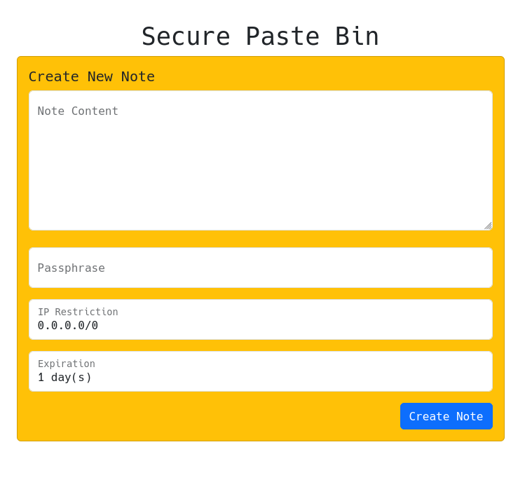

# Secure Paste Bin (SPB)

https://spb.ericc.ninja

Provides a simple way to share encyrpted notes with people. Utilizes the CryptoJS library to encyrpt messages on the frontend (within your browser) so that non-encrypted data never leaves your device. This enables true end-to-end encryption and ensures that the server hoster cannot see your data.

Users are forced to set a passphrase when creating a note, and optionally may choose to limit who can access the note by IP address restrictions. 

The IP restriction field allows subnets using / notation (1.1.1.0/24), single address (2.2.2.2), or multiple using a comma seperated list (3.3.0.0/16, 4.4.0.0/16).

Notes will automatically expire after a certain point, users may choose between 1 day and 15 days. This prevents resource exhasution for the host.

## Hosting
If you wish to self host this you will need the following:
- traefik reverse proxy setup with certificates to provide SSL
- docker compose

Look to the docker-compose.yml file included in this repo for an example on how to deploy this tool.